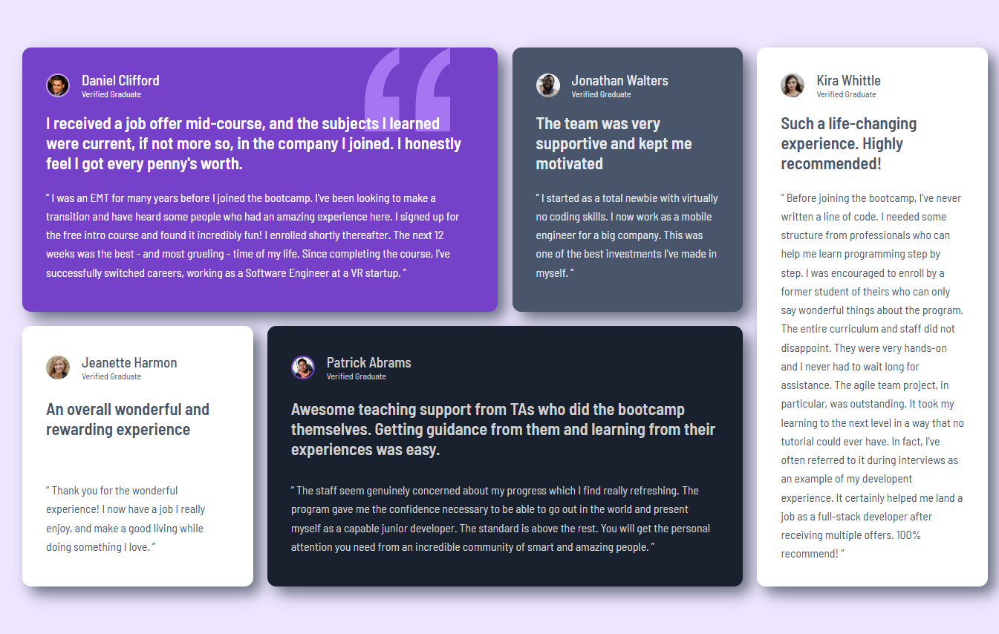

# Frontend Mentor - Testimonials grid section solution

This is a solution to the [Testimonials grid section challenge on Frontend Mentor](https://www.frontendmentor.io/challenges/testimonials-grid-section-Nnw6J7Un7).

## Table of contents

- [Overview](#overview)
  - [The challenge](#the-challenge)
  - [Screenshot](#screenshot)
  - [Links](#links)
- [My process](#my-process)
  - [Built with](#built-with)
  - [What I learned](#what-i-learned)
  - [Useful resources](#useful-resources)
- [Author](#author)

## Overview

### The challenge

Users should be able to:

- View the optimal layout for the site depending on their device's screen size

### Screenshot

### Links

- Solution URL: [Github](https://github.com/Hicham-BC/testimonials-grid-section-main)
- Live Site URL: [Website](https://hicham-bc.github.io/testimonials-grid-section-main/)

## My process

### Built with

- Semantic HTML5 markup
- CSS custom properties
- Flexbox
- CSS Grid
- Mobile-first workflow

### What I learned

- CSS Subgrid
- Grid Overlap

### Useful resources

- [Youtube - Jen Simmons Grid Overlap](https://www.youtube.com/watch?v=EashgVqboWo) - This helped me understand how does Grid Overlap work.

## Author

- Website - [@Hicham-BC](https://github.com/Hicham-BC)
- Frontend Mentor - [@Hicham-BC](https://www.frontendmentor.io/profile/Hicham-BC)